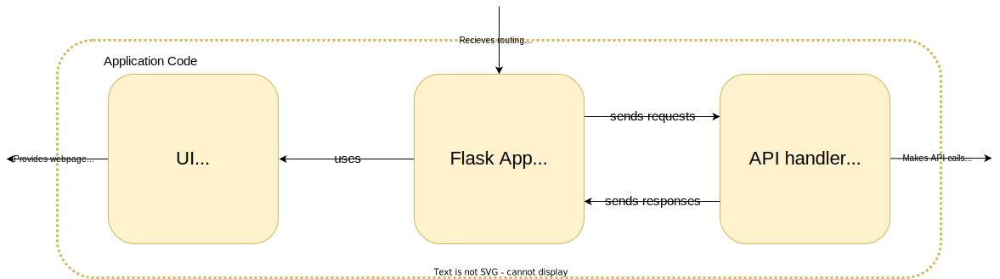
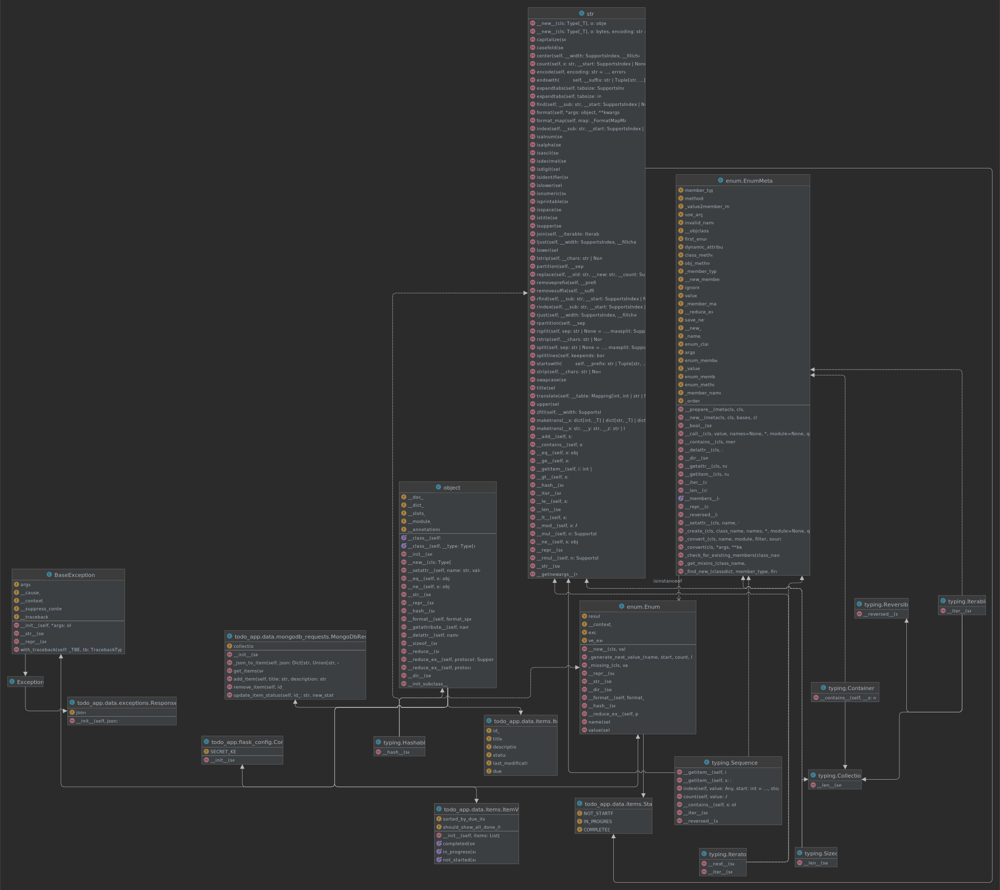

# Architecture Diagrams

## Context Diagram

## Container Diagram

## Component Diagram

## Code Diagram
<!--- generate using Pycharm https://www.jetbrains.com/help/pycharm/class-diagram.html -->

